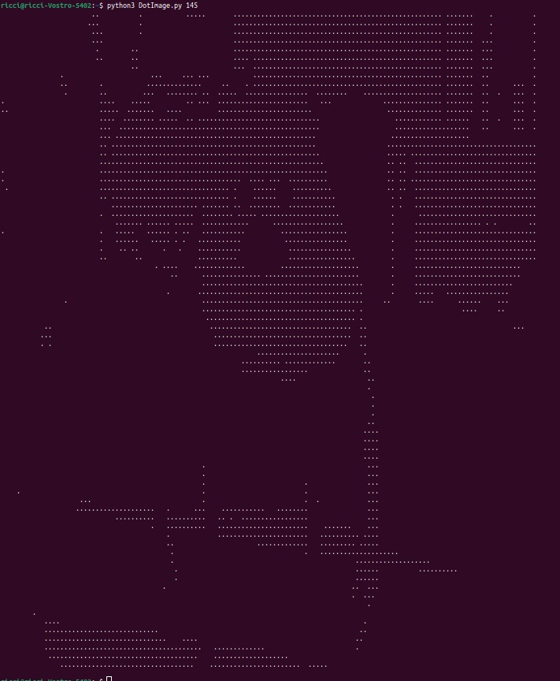

# Image-to-dots

Transform your images in text with dots.

# Requiriments

```pip install opencv-python```


# Execution

run ``` python DotImage.py ```

If you need change the limiar of the image, run ``` python DotImage.py numberOfLimiarHere```

# Exemplo


